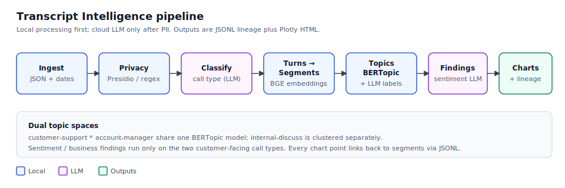

# Transcript Intelligence

Batch analytics pipeline for ~100 call transcripts: local PII redaction, call-type classification, topic discovery, sentiment/findings, and evidence-linked Plotly charts.



## Input

```text
dataset/<ulid>/
  transcript.json      # required — utterance list
  meeting-info.json    # required — startTime as call datetime
```

Other sibling files (`summary.json`, `speakers.json`, etc.) are ignored.

## Install

Use Python 3.11–3.13 (3.14 is not supported by spaCy wheels yet):

```shell
python3.11 -m venv .venv
source .venv/bin/activate
pip install -U pip
pip install -e .
python -m spacy download en_core_web_sm
cp .env.example .env   # set OPENAI_API_KEY
```

## Run

```shell
transcript-intelligence \
  --input interview-assignment/dataset \
  --output executions \
  --verbose
```

CLI flags are only `--input`, `--output`, and `--verbose`. All other settings come from `.env` (see `.env.example`), including `CLASSIFY_CONFIDENCE_THRESHOLD`.

Incomplete `execution_<id>` directories are resumed; completed stages are skipped. A completed execution causes the next run to allocate `execution_{n+1}`.

## Pipeline stages

### 1. Ingest

Discovers `*/transcript.json`, requires sibling `meeting-info.json`, validates utterances, and writes `transcripts.jsonl` + `utterances.jsonl`. Call datetime comes from `startTime` (not the folder ULID). `transcript_id` is the folder name.

### 2. Privacy (local)

**Microsoft Presidio** (spaCy NER) plus regex detectors for emails, phones, cards, account/case IDs. Speaker names are seeded into the pseudonym map first, then the same tokens are applied inside utterance text so `[PERSON_01]` is consistent as speaker and as a mention. Orgs/products on the allowlist are preserved. Reversible maps land under `privacy_stage/pii_mappings/`. Residuals go to a review queue but do not block the run.

Cloud LLM calls start only after this stage.

### 3. Classify (LLM)

Structured LLM call per transcript on the first N redacted utterances (`CLASSIFY_UTTERANCE_WINDOW`). Assigns `customer-support`, `account-manager`, or `internal-discuss` with confidence + rationale. No speaker-role invention (no ground-truth role file). Rows below `CLASSIFY_CONFIDENCE_THRESHOLD` are flagged in `classify_stage/review_queue.jsonl`.

### 4. Turns

One turn per redacted utterance (order = utterance index). Speaker is already a `[PERSON_xx]` token.

### 5. Segments + embeddings (local)

Adjacent turns are grouped into segments using **Sentence Transformers** `BAAI/bge-base-en-v1.5`: cosine similarity between turn embeddings decides topic shifts; a max token cap (`MAXIMUM_SEGMENT_TOKENS`, ≤500) force-splits before the model’s 512 limit. Segment vectors are written to `embeddings.npy`.

### 6. Clustering + topic representation (local) + labels (LLM)

**BERTopic** (UMAP → HDBSCAN → c-TF-IDF) discovers topics without a fixed taxonomy:

- **customer-topic-v1** — support ∪ account-manager segments together
- **internal-topic-v1** — internal-discuss alone

Outliers stay in lineage but are excluded from prevalence denominators. For each non-outlier cluster, top c-TF-IDF terms and centroid-nearest segments are selected automatically; an online LLM returns a short business label + description.

### 7. Sentiment / findings (LLM)

Customer-facing segments only. Structured extraction for sentiment, effort, frustration, resolution, objections, renewal risk, feature requests, opportunities, commitments — each with a `reason` and confidence. Drill into the linked `segment_id` for the underlying text. Provider `sentimentType` on raw utterances is ignored.

### 8. Aggregation + analytics

Pandas builds segment-based rates (not call- or customer-based) with full contributor lineage. Plotly writes HTML under `analytical_stage/html/`.

## Analysis outputs

All artifacts for a run live under `execution_<id>/`.

### Business metric charts

Under `analytical_stage/html/`:

| File | Meaning |
|---|---|
| `topic_prevalence_monthly.html` | % of non-outlier segments per topic, by call type and month |
| `topic_prevalence_all_time.html` | Same, aggregated across months |
| `sentiment_distribution.html` | Monthly % of customer-call segments with each sentiment value |
| `finding_prevalence.html` | Monthly % for each finding type/value on customer calls |

Hover a bar for numerator, denominator, rate, and `chart_point_id`. Metrics are **segment-based**. Small denominators are directional, not statistically strong.

BERTopic Plotly views (topic map / hierarchy when available) are under `clustering_stage/visualizations/`.

### How to read a chart point

1. Copy `chart_point_id` from the chart hover (also listed in `analytical_stage/chart_manifest.json`).
2. Find matching rows in `aggregation_stage/metric_contributors.jsonl` (`numerator` / `denominator_only` / `excluded`).
3. Open the segment text via `segment_id` in `segment_stage/segments.jsonl`.
4. Open call metadata via `transcript_id` in `ingest_stage/transcripts.jsonl`.

For an LLM finding, open `sentiment_stage/findings.jsonl` and follow `segment_id` into `segment_stage/segments.jsonl` (reason + fields explain the call-out; the segment is the evidence text).

Topic labels and membership:

```text
clustering_stage/topic_assignments.jsonl
topic_label_stage/topics.jsonl
```

Low-confidence call-type labels: `classify_stage/review_queue.jsonl`.

## Deferred

- Scalability / distributed workers
- Provider batch LLM mode
- Encrypted PII mapping files
- Soft-eval against provider `sentimentType`
- Production human-review workflow
